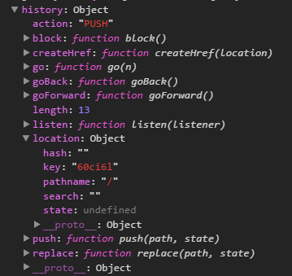

参考链接
> https://reacttraining.com/react-router/web/api/BrowserRouter
> https://github.com/ReactTraining/history

**版本：react-router V4**

# history
react-router官方文档有说`history is mutable`。
给的例子：
```js
class Comp extends React.Component {
  componentWillReceiveProps(nextProps) {
    // will be true
    const locationChanged = nextProps.location !== this.props.location

    // INCORRECT, will *always* be false because history is mutable.
    const locationChanged = nextProps.history.location !== this.props.history.location
  }
}
<Route component={Comp}/>
```
原因是：`<Route>`向`Comp`传入props包括` match, location, history, staticContext `(见`<Route>`分析),`history`是从`context`上下文中获取得到，一直是对同一个对象的引用，所以一直`nextProps.history.location === this.props.history.location`，而`nextProps.location !== this.props.location`，是因为在`history`库里面`history.location`的计算方式，是重新计算`location`对象。`const location = createLocation(path, state, createKey(), history.location)`。具体见https://github.com/ReactTraining/history/blob/master/modules/LocationUtils.js
<!--more-->
## createHistory(props={})
  ```js
  createBrowserHistory({
    basename: '',             // The base URL of the app (see below)
    forceRefresh: false,      // Set true to force full page refreshes
    keyLength: 6,             // The length of location.key
    // A function to use to confirm navigation with the user (see below)
    getUserConfirmation: (message, callback) => callback(window.confirm(message))
  })
  createMemoryHistory({
    initialEntries: [ '/' ],  // The initial URLs in the history stack
    initialIndex: 0,          // The starting index in the history stack
    keyLength: 6,             // The length of location.key
    // A function to use to confirm navigation with the user. Required
    // if you return string prompts from transition hooks (see below)
    getUserConfirmation: null
  })

  createHashHistory({
    basename: '',             // The base URL of the app (see below)
    hashType: 'slash',        // The hash type to use (see below)
    // A function to use to confirm navigation with the user (see below)
    getUserConfirmation: (message, callback) => callback(window.confirm(message))
  })
  ```
history对象结构：




# BrowserRouter
`BrowserRouter`是对`Router`封装后的高阶组件。封装进去了`browserHistory`。
```js
class BrowserRouter extends React.Component {
  static propTypes = {
    basename: PropTypes.string,
    forceRefresh: PropTypes.bool,
    getUserConfirmation: PropTypes.func,
    keyLength: PropTypes.number,
    children: PropTypes.node
  }

  history = createHistory(this.props)

  render() {
    return <Router history={this.history} children={this.props.children}/>
  }
}
```
`BrowserRouter`接收的props当做了`createHistory`的参数。
如果设置了`basename`属性，history初始化后，`history.location.pathname`的值是url中pathname除去`basename`后面的部分。
下面是在history的`createBrowserHistory`的部分源码：
```js
 const basename = props.basename ? stripTrailingSlash(addLeadingSlash(props.basename)) : ''
  const getDOMLocation = (historyState) => {
    const { key, state } = (historyState || {})
    const { pathname, search, hash } = window.location
    let path = pathname + search + hash
    if (basename)
      path = stripBasename(path, basename)//如果设置了basename，path会除去basename部分。
    return createLocation(path, state, key)
  }
  stripBasename = (path, prefix) =>
  hasBasename(path, prefix) ? path.substr(prefix.length) : path
```
如：
```js
<Router basename='reactRouter'>
  <Route path='/about' component={About}/>
</Router>
```
浏览器地址栏显示：http://localhost:3000/reactRouter/about，此时，`history.location.pathname='/about'`。

# Router
`Router`初始化路由环境，监听`history`对象变化触发更新，通过`context`向下传递`history`和`route`信息。
```js
 getChildContext() {
    return {
      router: {
        ...this.context.router,
        history: this.props.history,
        route: {
          location: this.props.history.location,
          match: this.state.match
        }
      }
    }
  }
  state = {
    match: this.computeMatch(this.props.history.location.pathname)
  }
  computeMatch(pathname) {
    return {
      path: '/',
      url: '/',
      params: {},
      isExact: pathname === '/'//作用是判断是精确全部匹配到尾，还是前部分匹配。
    }
  }
  componentWillMount() {
    const { children, history } = this.props
    invariant(
      children == null || React.Children.count(children) === 1,
      'A <Router> may have only one child element'
    )
    // Do this here so we can setState when a <Redirect> changes the
    // location in componentWillMount. This happens e.g. when doing
    // server rendering using a <StaticRouter>.
    // history.listen会监听history的变化，触发组件更新。
    this.unlisten = history.listen(() => {
      this.setState({
        match: this.computeMatch(history.location.pathname)
      })
    })
  }
  //render只是将子组件简单的渲染输出。
  render() {
    const { children } = this.props
    return children ? React.Children.only(children) : null
  }
```
可以看出`match`对象结构：
```js
{
  path: '/',
  url: '/',
  params: {},
  isExact: pathname === '/'//作用是判断是精确全部匹配到尾，还是前部分匹配。
}
```
# Route
`Route`作用：根据`location`和`path`匹配路由,判断是否渲染`component`，并向`component`传入props`{ match, location, history, staticContext }`

在Route.js的render函数中添加注释：` console.log("<start>\n",this.props.path,this.state.match,"\n</end>")`进行测试，
观察`match`对象变化，发现顶层路由`Route`都会进行匹配判断。
```js
class Route extends React.Component {
  static propTypes = {
    computedMatch: PropTypes.object, // private, from <Switch>
    path: PropTypes.string,
    exact: PropTypes.bool,//精确匹配路由
    strict: PropTypes.bool,//严格匹配路径，关乎尾随的斜杠。
    component: PropTypes.func,//路由匹配时，渲染指定组件。
    render: PropTypes.func,//不指定component的情况下，可以使用render来渲染匹配的组件。
    children: PropTypes.oneOfType([ //在路径匹配的情况下会渲染children，exact属性无效
      PropTypes.func,
      PropTypes.node
    ]),
    location: PropTypes.object//设置Location，作用暂时不知。
  }
  static contextTypes = {
    router: PropTypes.shape({
      history: PropTypes.object.isRequired,
      route: PropTypes.object.isRequired,
      staticContext: PropTypes.object
    })
  }
  static childContextTypes = {
    router: PropTypes.object.isRequired
  }
  getChildContext() { //更新context中的route属性，继续向子元素传递。
    return {
      router: {
        ...this.context.router,
        route: {
          location: this.props.location || this.context.router.route.location,
          match: this.state.match
        }
      }
    }
  }
  state = {
    match: this.computeMatch(this.props, this.context.router)
  }
  //计算match对象的值，<Switch>已经计算了computedMatch，具体见<Switch>分析。
  computeMatch({ computedMatch, location, path, strict, exact }, { route }) {
    if (computedMatch)
      return computedMatch // <Switch> already computed the match for us

    const pathname = (location || route.location).pathname //这里的pathname就是，浏览器导航栏显示的路径的一部分。
      // 当Route设置为<Route path='/Topics/:topicId' component={Topic}/>，
      // 并且路由匹配后，match对象会有，params属性，记录匹配的参数。
      // 如点击<Link to='/Topics/rendering'>rendering</Link>后（此时location.pathname='/Topics/rendering'），
      // 此时match.params={topicId:rendering}。
      // 如果不设置path props，则使用this.context.router.match的值,这样该Route对应的组件会渲染。
      // matchPath计算match对象。
    return path ? matchPath(pathname, { path, strict, exact }) : route.match
  }
  componentWillMount() {
    const { component, render, children } = this.props
  }
  componentWillReceiveProps(nextProps, nextContext) {
    this.setState({
      match: this.computeMatch(nextProps, nextContext.router)
    })
  }
  render() {
    const { match } = this.state
    const { children, component, render } = this.props
    const { history, route, staticContext } = this.context.router
    const location = this.props.location || route.location
    const props = { match, location, history, staticContext }
    return (
      component ? ( // component prop gets first priority, only called if there's a match
        match ? React.createElement(component, props) : null
      ) : render ? ( // render prop is next, only called if there's a match
        match ? render(props) : null
      ) : children ? ( // children come last, always called
        typeof children === 'function' ? (
          children(props)
        ) : !Array.isArray(children) || children.length ? ( // Preact defaults to empty children array
          React.Children.only(children)
        ) : (
          null
        )
      ) : (
        null
      )
    )
  }
}
```
从render函数可以看出，优先级顺序是component>render>children。并且children分支没有判断match再进行返回。
三目运算符：
`a?b:c?d:e`,这行代码应该等同于`a?b:(c?d:e)`,两个三目运算符，优先级相同，优先级相同时，从右往左结合。
但是运算还是从左往右运算。结合和运算要区分开来。
```js
 expression1 ? sentence1 :
 expression2 ? sentence2 :
 expression3 ? sentence3 :
 ...
```
只要任意一个expressionN的判断为真，那么sentenceN立即执行，这个判断结束，后面的任何判断不再执行。而如果我们写成if-else
```js
  if(expression1){
      sentence1;
  } else if(expression2){ 
    sentence2;
  } else if(expression3){
    sentence3;
  } ...
```

## matchPath.js
`matchPath(pathname, options = {})`返回match对象。用于计算match对象。
有使用到`path-to-regexp`库。
`path-to-regexp`使用方法：https://github.com/pillarjs/path-to-regexp<a href="https://npmjs.org/package/path-to-regexp"></a>
* `path` An Express-style string, an array of strings, or a regular expression.
* `keys` An array to be populated with the keys found in the path.
* `options`
    * `sensitive` When true the route will be case sensitive. (default: false)
    * `strict` When false the trailing slash is optional. (default: false)
    * `end` When false the path will match at the beginning. (default: true)
    * `delimiter` Set the default delimiter for repeat parameters. (default: '/')
```js
var keys = []
var re = pathToRegexp('/foo/:bar', keys)
// re = /^\/foo\/([^\/]+?)\/?$/i
// keys = [{ name: 'bar', prefix: '/', delimiter: '/', optional: false, repeat: false, pattern: '[^\\/]+?' }]
```
`RegExp.prototype.exec()`,返回结果result是一个数组，result[0]表示匹配的全部字符串，[1], ...[n]括号中的分组捕获,index:	匹配到的字符位于原始字符串的基于0的索引值,input:原始字符串,[mdn exec](https://developer.mozilla.org/zh-CN/docs/Web/JavaScript/Reference/Global_Objects/RegExp/exec)

# Link
`Link`:作用是一个链接，点击链接触发`history.push`或者`history.replace`,会触发`Router`组件的`history.listen`添加的回调，调用`setState`触发组件更新，进一步`Route`组件重新匹配路由，渲染对应组件。

modifier keys：ctrl，alt，metaKey，shift。

```js
class Link extends React.Component {
  static propTypes = {
    onClick: PropTypes.func,
    target: PropTypes.string,
    replace: PropTypes.bool,
    to: PropTypes.oneOfType([
      PropTypes.string,
      PropTypes.object
    ]).isRequired
  }
  static defaultProps = {
    replace: false
  }
  static contextTypes = {
    router: PropTypes.shape({
      history: PropTypes.shape({
        push: PropTypes.func.isRequired,
        replace: PropTypes.func.isRequired,
        createHref: PropTypes.func.isRequired
      }).isRequired
    }).isRequired
  }
  handleClick = (event) => {
    if (this.props.onClick)
      this.props.onClick(event)
    if (
      !event.defaultPrevented && // onClick prevented default
      event.button === 0 && // ignore right clicks
      !this.props.target && // let browser handle "target=_blank" etc.
      !isModifiedEvent(event) // ignore clicks with modifier keys
    ) {
      event.preventDefault()//阻止默认行为
      const { history } = this.context.router
      const { replace, to } = this.props
      //history对象更新，触发Router组件中的history.listen事件，调用setState，触发组件更新，Route组件会重新进行路由匹配。
      if (replace) {
        history.replace(to) 
      } else {
        history.push(to)
      }
    }
  }

  render() {
    const { replace, to, ...props } = this.props // eslint-disable-line no-unused-vars
  //const createHref = (location) =>basename + createPath(location)
    const href = this.context.router.history.createHref(
      typeof to === 'string' ? { pathname: to } : to
    )

    return <a {...props} onClick={this.handleClick} href={href}/>
  }
}

export default Link
```
# NavLink
`NavLink`:是对`Link`的封装，可以添加导航活动状态的样式。
```js
const NavLink = ({
  to,
  exact,
  strict,
  location,
  activeClassName,
  className,
  activeStyle,
  style,
  isActive: getIsActive,
  ...rest
}) => (
  //这里Route使用的是children进行渲染子组件，此时无论路由是否匹配，都会渲染Link.
  //注意Route的path和Link的to参数，只要Link别点击，该Route就会匹配，这时计算的match对象不为null,
  //match对象和location会被传入getIsActive函数，进行link是否active的判断，和进而重新渲染Link。
  <Route
    path={typeof to === 'object' ? to.pathname : to}
    exact={exact}
    strict={strict}
    location={location}
    children={({ location, match }) => {
      const isActive = !!(getIsActive ? getIsActive(match, location) : match)

      return (
        <Link
          to={to}
          className={isActive ? [ className, activeClassName ].filter(i => i).join(' ') : className}
          style={isActive ? { ...style, ...activeStyle } : style}
          {...rest}
        />
      )
    }}
  />
)
NavLink.propTypes = {
  to: Link.propTypes.to,
  exact: PropTypes.bool,
  strict: PropTypes.bool,
  location: PropTypes.object,
  activeClassName: PropTypes.string,
  className: PropTypes.string,
  activeStyle: PropTypes.object,
  style: PropTypes.object,
  isActive: PropTypes.func
}
NavLink.defaultProps = {
  activeClassName: 'active'
}
```
上面可以看出`NavLink`接受的props。接收`isActive`是一个函数,内部调用`getIsActive(match, location)`传入了`match`和`location`，让使用者来判定该链接是否为`active`状态,如果是`active`状态,会给链接添加使用者传入的样式。
可以像下面使用。
```js
<NavLink 
  to="/news" 
  activeStyle={{fontSize:'18px',color:'red'}} 
  isActive={(match,location)=>{if(match)return true}}
 >News</NavLink>
```
# Redirect
重定向链接
```js
class Redirect extends React.Component {
  static propTypes = {
    push: PropTypes.bool, //表示是否要使用history.push改变history。
    from: PropTypes.string,//表示从指定路径跳转到目的路径（location）,与Switch配合使用。
    to: PropTypes.oneOfType([
      PropTypes.string,
      PropTypes.object
    ])
  }

  static defaultProps = {
    push: false
  }

  static contextTypes = {
    router: PropTypes.shape({
      history: PropTypes.shape({
        push: PropTypes.func.isRequired,
        replace: PropTypes.func.isRequired
      }).isRequired,
      staticContext: PropTypes.object
    }).isRequired
  }

  isStatic() {
    return this.context.router && this.context.router.staticContext
  }

  componentWillMount() {
    if (this.isStatic())
      this.perform()
  }

  componentDidMount() {
    if (!this.isStatic())
      this.perform()
  }

  perform() {
    const { history } = this.context.router
    const { push, to } = this.props

    if (push) {
      history.push(to)
    } else {
      history.replace(to)
    }
  }

  render() {
    return null
  }
}
```
# Switch
`<Switch>`的所有孩子应该是`<Route>`或者`<Redirect>`。只有第一个匹配当前location的孩子会被渲染。

`<Route>`使用`path`属性进行匹配，`<Redirect>`使用`from`属性进行匹配。如果`<Route>`没有`path`属性
或者`<Redirect>`没有`from`属性则总是匹配当前的location（与`history.location.pathname`比较）。

当 `<Switch>`包含一个`<Redirect>`时，这个`<Redirect>`像`<Route>`一样，可以设置的props增加了`path`、`exact`、`strict`，这些都会起作用，如果没有设置`path`,属性中的`from`,当做`path`使用。具体实现，代码如下：

```js
/**
 * The public API for rendering the first <Route> that matches.
 */
class Switch extends React.Component {
  static contextTypes = {
    router: PropTypes.shape({
      route: PropTypes.object.isRequired
    }).isRequired
  }

  static propTypes = {
    children: PropTypes.node,
    location: PropTypes.object
  }

  componentWillReceiveProps(nextProps) {
    warning(
      !(nextProps.location && !this.props.location),
      '<Switch> elements should not change from uncontrolled to controlled (or vice versa). You initially used no "location" prop and then provided one on a subsequent render.'
    )

    warning(
      !(!nextProps.location && this.props.location),
      '<Switch> elements should not change from controlled to uncontrolled (or vice versa). You provided a "location" prop initially but omitted it on a subsequent render.'
    )
  }

  render() {
    const { route } = this.context.router
    const { children } = this.props
    const location = this.props.location || route.location

    let match, child
    React.Children.forEach(children, element => {
      if (!React.isValidElement(element)) return

      const { path: pathProp, exact, strict, from } = element.props
      const path = pathProp || from //<Redirect from='/old-path' to='/new-path'/>,只有指定路径（from）才跳转到to。
      //这里限制了渲染第一个匹配路由的Route或者Redirect。
      if (match == null) {
        child = element
        match = path ? matchPath(location.pathname, { path, exact, strict }) : route.match
      }
    })
    //这里的cloneElement传入{ location, computedMatch: match }是为<Route>使用的，对<Redirect>并不起作用。
    return match ? React.cloneElement(child, { location, computedMatch: match }) : null
  }
}
```
# Prompt
在一个组件内使用，当该组件要被卸载的时候会被调用，即导航到别处的时候会询问是否离开。
发下了一个问题：当离开的时候点击的否，不会刷新页面，但是在点击当前导航的时候，还会发出同样的询问，不知是否正常。
基本原因：通过`<Prompt>`设置了提示信息是全局的，只要没有取消提示信息，点击`<Link>`组件都会触发提示。
只有切换到其它导航，`<Prompt>`被卸载，设置的提示信息被取消，其它导航间切换不会有提示。
```js

/**
 * The public API for prompting the user before navigating away
 * from a screen with a component.
 */
class Prompt extends React.Component {
  static propTypes = {
    when: PropTypes.bool,
    message: PropTypes.oneOfType([
      PropTypes.func,
      PropTypes.string
    ]).isRequired
  }

  static defaultProps = {
    when: true
  }

  static contextTypes = {
    router: PropTypes.shape({
      history: PropTypes.shape({
        block: PropTypes.func.isRequired
      }).isRequired
    }).isRequired
  }

  enable(message) {
    if (this.unblock)
      this.unblock()
      //history.block(message)添加导航切换的提示信息，返回取消提示的方法。
    this.unblock = this.context.router.history.block(message)
  }

  disable() {
    if (this.unblock) {
      //取消导航切换提示。
      this.unblock()
      this.unblock = null
    }
  }
  //当<Prompt>挂载的时候，设置导航切换前提示。
  componentWillMount() {
    if (this.props.when)
      this.enable(this.props.message)
  }

  componentWillReceiveProps(nextProps) {
    if (nextProps.when) {
      if (!this.props.when || this.props.message !== nextProps.message)
        this.enable(nextProps.message)
    } else {
      this.disable()
    }
  }
  //当<Prompt>卸载的时候,取消导航切换提示。
  componentWillUnmount() {
    this.disable()
  }

  render() {
    return null
  }
}
```
从`<Prompt>`设计可以看出，在`<Prompt>`将要挂载的时候调用了`history.block(message)`，这个操作使得在调用`history.push`或者`history.replace`（`<Link>`）的时候，改变浏览器本地location和history之前，会进行切换导航前的提示。
具体实现参见`history`[block](https://github.com/ReactTraining/history/blob/master/modules/createBrowserHistory.js#L267)
`<BrowserRouter>`有个props是`getUserConfirmation`,它是`createHistory`暴露给用户的接口，可让用户可以自定义转移确认行为。
转移确认默认的行为是`history`库内部的[getConfirmation](https://github.com/ReactTraining/history/blob/master/modules/DOMUtils.js#L15)：
```js
export const getConfirmation = (message, callback) =>
  callback(window.confirm(message)) 
```

# withRouter
高阶组件。使用`withRouter`包裹的`Component`,每一次路由改变`Component`都会重新渲染。是因为`<Route>`渲染了属性：`{match,location,history}`。就像React-Redux的connect函数。
```js
/**
 * A public higher-order component to access the imperative API
 */
const withRouter = (Component) => {
  const C = (props) => {
    const { wrappedComponentRef, ...remainingProps } = props
    return (
      <Route render={routeComponentProps => (
        <Component {...remainingProps} {...routeComponentProps} ref={wrappedComponentRef}/>
      )}/>
    )
  }

  C.displayName = `withRouter(${Component.displayName || Component.name})`
  C.WrappedComponent = Component
  C.propTypes = {
    wrappedComponentRef: PropTypes.func
  }

  return hoistStatics(C, Component) //该方法的作用是除了特殊属性外将Component上属性复制到C上。
}
```
# HashRouter
使用了`history/createHashHistory`。
```js
import createHistory from 'history/createHashHistory'
import { Router } from 'react-router'

/**
 * The public API for a <Router> that uses window.location.hash.
 */
class HashRouter extends React.Component {
  static propTypes = {
    basename: PropTypes.string,
    getUserConfirmation: PropTypes.func,
    hashType: PropTypes.oneOf([ 'hashbang', 'noslash', 'slash' ]),
    children: PropTypes.node
  }

  history = createHistory(this.props)

  render() {
    return <Router history={this.history} children={this.props.children}/>
  }
}
```

# StaticRouter
用途：服务器端渲染。
用户在浏览器地址栏输入要访问的地址回车后，向服务器发出请求，服务器根据url进行解析。
但是服务器要能正确判断，请求的url是前端路由，还是请求的其它静态资源。
判断是前端路由后，执行服务器端渲染。
```js
ReactDOMServer.renderToString(
    <StaticRouter location={req.url} context={context}>
      <App/>
    </StaticRouter>
  )
```
在服务器端不会有用户点击`<Link>`以及前进后退。但是可能会有`<Redirect>`或者其它组件在`componentWillMount`中操作`history.push`或者`history.replace`。这样会改变`location`。要想渲染出想要的结果，服务器端会向浏览器发出重定向请求，这样浏览器会发送新的url请求,然后服务器端再次做出相应。
服务器如何才能发送正确的重定向请求呢？就是使用一个`staticContext`对象进行记录，就是传入`<StaticRouter>`的`context`对象。
在服务器端渲染完成后，这个对象只会记录，最后一次的`location`信息。
具体实现如下：
```js
import { addLeadingSlash, createPath, parsePath } from 'history/PathUtils'
import Router from './Router'
//规范化location
const normalizeLocation = (object) => {
  const { pathname = '/', search = '', hash = '' } = object

  return {
    pathname,
    search: search === '?' ? '' : search,
    hash: hash === '#' ? '' : hash
  }
}
//添加basename
const addBasename = (basename, location) => {
  if (!basename)
    return location

  return {
    ...location,
    pathname: addLeadingSlash(basename) + location.pathname
  }
}
//剥离basename
const stripBasename = (basename, location) => {
  if (!basename)
    return location

  const base = addLeadingSlash(basename)

  if (location.pathname.indexOf(base) !== 0)
    return location

  return {
    ...location,
    pathname: location.pathname.substr(base.length)
  }
}
//创建location
const createLocation = (location) =>
  typeof location === 'string' ? parsePath(location) : normalizeLocation(location)
//创建URL，pathname+search+hash
const createURL = (location) =>
  typeof location === 'string' ? location : createPath(location)
//一些方法不能再StaticRouter中设置。
const staticHandler = (methodName) => () => {
  invariant(
    false,
    'You cannot %s with <StaticRouter>',
    methodName
  )
}
//空方法
const noop = () => {}

/**
 * The public top-level API for a "static" <Router>, so-called because it
 * can't actually change the current location. Instead, it just records
 * location changes in a context object. Useful mainly in testing and
 * server-rendering scenarios.
 */
class StaticRouter extends React.Component {
  static propTypes = {
    basename: PropTypes.string,
    context: PropTypes.object.isRequired,
    location: PropTypes.oneOfType([
      PropTypes.string,
      PropTypes.object
    ])
  }

  static defaultProps = {
    basename: '',
    location: '/'
  }

  static childContextTypes = {
    router: PropTypes.object.isRequired
  }
//<StaticRouter>通过context向<Router>传递数据。向<BrowserRouter>、<HashRouter>、<MemoryRouter>都没有这样的操作。
//主要还是因为服务器端渲染的需要。
  getChildContext() {
    return {
      router: {
        staticContext: this.props.context
      }
    }
  }
 //使用箭头函数，绑定this对象。因为history对象会向子组件传递，要使得这里的this可以正确访问this.props。
  createHref = (path) =>
    addLeadingSlash(this.props.basename + createURL(path))
//这里是history.push方法
  handlePush = (location) => {
    const { basename, context } = this.props
    context.action = 'PUSH'
    context.location = addBasename(basename, createLocation(location))
    context.url = createURL(context.location)
  }
//这里是history.replace方法。可以看出这里的push和replace方法都是设置this.props.context对象。可以根据context.url判断是否需要重定向。
  handleReplace = (location) => {
    const { basename, context } = this.props
    context.action = 'REPLACE'
    context.location = addBasename(basename, createLocation(location))
    context.url = createURL(context.location)
  }

  handleListen = () =>
    noop

  handleBlock = () =>
    noop

  render() {
    const { basename, context, location, ...props } = this.props

    const history = {
      createHref: this.createHref,
      action: 'POP',
      location: stripBasename(basename, createLocation(location)),
      push: this.handlePush,
      replace: this.handleReplace,
      go: staticHandler('go'),//使用StaticRoute不可以使用go，goBack，goForward方法。
      goBack: staticHandler('goBack'),
      goForward: staticHandler('goForward'),
      listen: this.handleListen, //listen和block都是空方法
      block: this.handleBlock
    }

    return <Router {...props} history={history}/>
  }
}
```
在测试服务器端渲染的时候发现了一个问题。
路由问题，如果静态资源使用了相对路径，静态资源访问出错。比如访问：`http://localhost:3000/topics/aaa`, 
topics是设置的前端路由，这时加载相对路径的静态资源比如`./static/js/main.d23df278.js`,
客户端向服务器请求是路径会解析成`http://localhost:3000/topics/static/js/main.d23df278.js`,
这时就不能请求到正确的文件。要是使用绝对路径，就没有这个问题了。`/static/js/main.d23df278.js`
会被解析成相对网站根目录的`http://localhost:3000/static/js/main.d23df278.js`。

# MemoryRouter
在内存中保存history（不从地址栏读取，不向地址栏写入）。用途：测试，native环境。
```js
import React from 'react'
import PropTypes from 'prop-types'
import createHistory from 'history/createMemoryHistory'
import Router from './Router'

/**
 * The public API for a <Router> that stores location in memory.
 */
class MemoryRouter extends React.Component {
  static propTypes = {
    initialEntries: PropTypes.array,
    initialIndex: PropTypes.number,
    getUserConfirmation: PropTypes.func,
    keyLength: PropTypes.number,
    children: PropTypes.node
  }

  history = createHistory(this.props)

  render() {
    return <Router history={this.history} children={this.props.children}/>
  }
}

export default MemoryRouter

```
上面可以看出，`<MemoryRouter>`使用`createMemoryHistory`构造的`history`，其它都一样，只有这么多。具体怎么实现要看`history`库的实现了。
`createMemoryHistory`返回的`history`对象结构：
```js
const history = {
    length: entries.length,
    action: 'POP',
    location: entries[index],
    index,  //当前location索引。
    entries,//保存location信息的数组即history信息。
    createHref,
    push,
    replace,
    go,
    goBack,
    goForward,
    canGo,
    block,
    listen
  }
```
`createBrowserHistory`返回的`history`对象结构：
```js
const history = {
    length: globalHistory.length,
    action: 'POP',
    location: initialLocation,
    createHref,
    push,
    replace,
    go,
    goBack,
    goForward,
    block,
    listen
  }

```

# 总结
`react-router`机制：当URL更改时，它被`History` API的状态机制拦截，然后重新渲染整个视图。
react-router v4 中所有的控制都是通过组件形式。
在v4以前的版本中，称为静态路由，是通过配置的形式控制路由，路由和组件是分离的；
v4称为动态路由，在app的渲染过程中，动态的匹配路由，组件和路由可以嵌套使用。
没有看过v4以前的源码，只是使用过v3，因此不能进行深入的对比。
react-router源码并不多，设计的很精巧。
`history`是`react-router`的重要依赖，想要更加深刻的理解，必须要对`history`有足够的认识。
有时间再系统的分析一下`history`源码。

