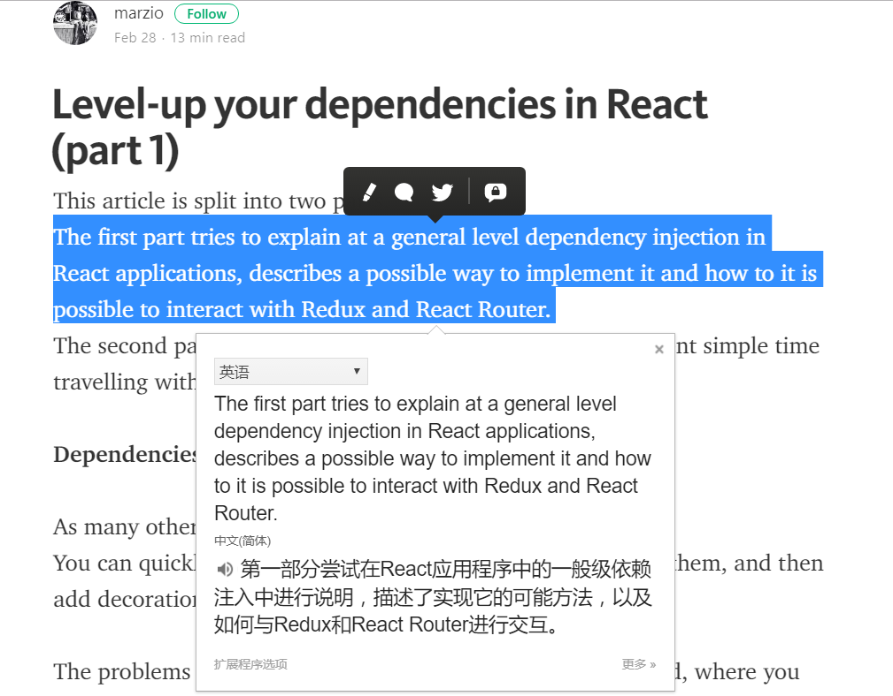
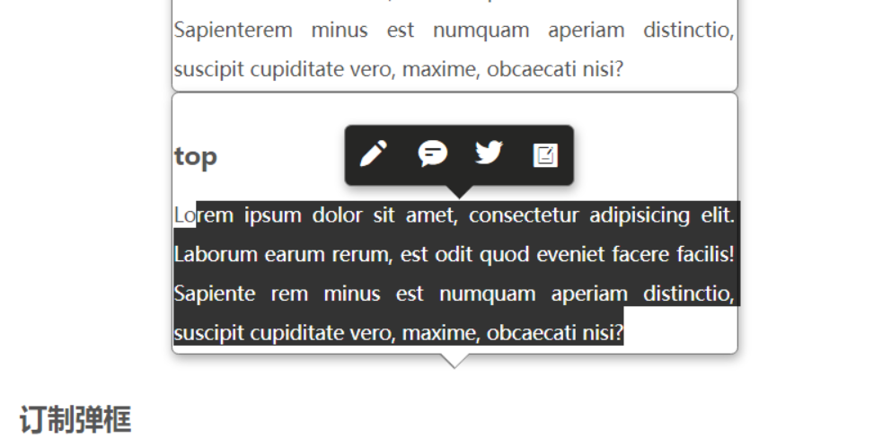

<link rel="stylesheet" type="text/css" href="//at.alicdn.com/t/font_ajz0qys9mh392j4i.css"/>
<style>
  .popover {
    position: absolute;
    display: block;
    padding: 1px;
    margin: 0;
    max-width: 400px;
    background: #fff;
    border: 1px solid #777;
    box-shadow: 1px 3px 10px #aaa;
    border-radius: 5px;
  }

  .popover>.arrow {
    position: absolute;
    display: block;
    width: 0;
    height: 0;
    border: 11px solid;
    border-color: transparent;
  }

  .popover>.arrow::after {
    position: absolute;
    display: block;
    content: '';
    width: 0;
    height: 0;
    border: 10px solid;
    border-color: transparent;
  }

  .popover.bottom>.arrow {
    border-top-width: 0px;
    border-bottom-color: #777;
    top: -11px;
    left: 50%;
    margin-left: -11px;
  }

  .popover.bottom>.arrow::after {
    border-top-width: 0px;
    border-bottom-color: #fff;
    top: 1px;
    left: -10px;
  }


  .popover.top>.arrow {
    border-bottom-width: 0px;
    border-top-color: #777;
    margin-left: -11px;
    left: 50%;
    top: 100%;
  }

  .popover.top>.arrow::after {
    border-bottom-width: 0px;
    border-top-color: #fff;
    left: -10px;
    top: -11px;
  }

  .popover.bottom.edit>.arrow {
    border-bottom-color: transparent;
  }

  .popover.bottom.edit>.arrow::after {
    border-bottom-color: #262625;
  }

  .popover.top.edit>.arrow {
    border-top-color: transparent;
  }

  .popover.top.edit>.arrow::after {
    border-top-color: #262625;
  }
</style>

# 起源
前两天看到一个面试题，问CSS实现三角形原理，想到以前做过气泡弹出框，气泡弹出框的小角是个三角形，因此对CSS实现三角形原理还是了解的。但是具体实现有些生疏了，因此又实现了一遍。同时注意到，使用Google划词翻译的时候，会弹出气泡框显示翻译内容，激发了我做出这种效果的欲望，可是那时候正在学习其它的东西，就先搁置先来了，不过呢，看来是天意，鬼使神差般把我链接到了[medium](https://medium.com/@marziosuperina/level-up-your-dependencies-in-react-part-1-d67bb2711b51)。并且有下面的情形。

这时就决定做一个玩玩。
<!--more-->
# 过程
## 弹出框实现 
首先我选择了从弹出框入手，以前做过类似的例子，但是弹框气泡头可以向左、向右、向上、向下。在实现的时候需要好好设计。由于自己经验不足，因此参考了[bootstrap](http://v3.bootcss.com/javascript/#popovers) 上组件的实现。这里只实现了向上、向下的情况。
代码如下：
css:  
```css
  .popover {
    position: absolute;
    display: block;
    padding: 1px;
    margin: 0;
    max-width: 400px;
    background: #fff;
    border: 1px solid #777;
    box-shadow: 1px 3px 10px #aaa;
    border-radius: 5px;
  }

  .popover>.arrow {
    position: absolute;
    display: block;
    width: 0;
    height: 0;
    border: 11px solid;
    border-color: transparent;
  }

  .popover>.arrow::after {
    position: absolute;
    display: block;
    content: '';
    width: 0;
    height: 0;
    border: 10px solid;
    border-color: transparent;
  }
/*弹框显示在指定区域下方*/
  .popover.bottom>.arrow {
    border-top-width: 0px;
    border-bottom-color: #777;
    top: -11px;
    left: 50%;
    margin-left: -11px;
  }

  .popover.bottom>.arrow::after {
    border-top-width: 0px;
    border-bottom-color: #fff;
    top: 1px;
    left: -10px;
  }


/*弹框显示在指定区域上方*/
  .popover.top>.arrow {
    border-bottom-width: 0px;
    border-top-color: #777;
    margin-left: -11px;
    left: 50%;
    top: 100%;
  }

  .popover.top>.arrow::after {
    border-bottom-width: 0px;
    border-top-color: #fff;
    left: -10px;
    top: -11px;
  }
/*剩下的不写了*/
```
html:  
```html
  <div style="position:relative">
    <div style="float:left;position:relative;" class="popover bottom">
      <div class="arrow"></div>
      <h3 class="title">bottom</h3>
      <div class="content">
        Lorem ipsum dolor sit amet, consectetur adipisicing elit. Laborum earum rerum, est odit quod eveniet facere facilis! Sapiente
        rem minus est numquam aperiam distinctio, suscipit cupiditate vero, maxime, obcaecati nisi?
      </div>
    </div>
    <div style="float:left;position:relative;" class="popover top">
      <div class="arrow"></div>
      <h3 class="title">top</h3>
      <div class="content">
        Lorem ipsum dolor sit amet, consectetur adipisicing elit. Laborum earum rerum, est odit quod eveniet facere facilis! Sapiente
        rem minus est numquam aperiam distinctio, suscipit cupiditate vero, maxime, obcaecati nisi?
      </div>
    </div>
  </div>
```
效果：

 <div style="position:relative;float:left;display:flex;justify-content:center;flex-wrap:wrap"> <div style="float:left;position:relative;" class="popover bottom"> <div class="arrow"></div><h3 class="title">bottom</h3> <div class="content"> Lorem ipsum dolor sit amet, consectetur adipisicing elit. Laborum earum rerum, est odit quod eveniet facere facilis! Sapienterem minus est numquam aperiam distinctio, suscipit cupiditate vero, maxime, obcaecati nisi? </div></div><div style="float:left;position:relative;" class="popover top"><div class="arrow"></div><h3 class="title">top</h3><div class="content"> Lorem ipsum dolor sit amet, consectetur adipisicing elit. Laborum earum rerum, est odit quod eveniet facere facilis! Sapiente rem minus est numquam aperiam distinctio, suscipit cupiditate vero, maxime, obcaecati nisi?</div></div></div> 
<div style="clear:both"></div>

## 订制弹框
显示效果如下，可以在该页面尝试。

更改箭头颜色
```css
  .popover.bottom.edit>.arrow {
    border-bottom-color: transparent;
  }

  .popover.bottom.edit>.arrow::after {
    border-bottom-color: #262625;
  }

  .popover.top.edit>.arrow {
    border-top-color: transparent;
  }

  .popover.top.edit>.arrow::after {
    border-top-color: #262625;
  }
```
创建弹出框，`tools.createElement`是自己封装的方法。通过审查元素可以看到。
```js
function createEditPopover() {
    var arrowDOM = tools.createElement('div', {
      className: 'arrow',
    });
    var contentDOM = tools.createElement('div', {
      className: 'popover-content',
      style: { lineHeight: '40px', color: '#fff' },
      innerHTML: '<i style="font-size:22px;margin:0 7px" class="iconfont icon-edit1 ">\
        </i><i style="font-size:22px;margin:0px 7px" class="iconfont icon-message "></i>\
        </i><i style="font-size:22px;margin:0px 7px;margin-top:2px" class="iconfont icon-twitter"></i>\
        </i><i style="font-size:22px;margin:0px 7px" class="iconfont icon-wodebiji"></i>'
    });
    var popoverWidth = 160,
      popoverHeight = 40;
    var popoverDOM = tools.createElement('div', {
      style: {
        width: popoverWidth + 'px',
        height: popoverHeight + 'px',
        top: 0,
        left: 0,
        userSelect: 'none',
        background: '#262625',
        zIndex: 2000
      }
    }, [arrowDOM, contentDOM]);
    return popoverDOM;
  }
```
## 获得选择区域
本以为，获取选择区域及内容可以通过`onselect`事件获得，测试发现不行，`onselect`只能作用域文本输入框`<input type="text">, <textarea>`。要是想获取选择的`div`内容时，就要用到`window.getSelection`。参考[mdn getSelection](https://developer.mozilla.org/zh-CN/docs/Web/API/Window/getSelection),[mdn selection](https://developer.mozilla.org/zh-CN/docs/Web/API/Selection),[mdn range](https://developer.mozilla.org/zh-CN/docs/Web/API/Range)。获取选择内容很简单。但是要做的是，选中文字的时候，弹框出现在选中文字区域的中心，因此就要获取到选择区域的位置信息。开始的时候没注意`range`对象的方法，就在Stack Overflow搜到了一个和我现在要做的一样的内容。自己再走前人走过的坑，善用搜索引擎！[前往](https://stackoverflow.com/questions/31559219/position-element-to-center-of-selected-range),惊人的相似。

代码如下：
```js
 function getSelectedTextPos() {
      if (window.getSelection) {
        var selection = window.getSelection();
        var range = selection.getRangeAt(0);
        var rect = range.getBoundingClientRect();
        //常规浏览器
        // {
        //   bottom: 49.60000228881836,
        //   height: 20.80000114440918,
        //   left: 376,
        //   right: 389.6000061035156,
        //   top: 28.80000114440918,
        //   width: 13.600006103515625
        // }
        return rect;
      }
      else if (document.getSelection) {
        var selection = document.getSelection();
        var range = selection.getRangeAt(0);
        var rect = range.getBoundingClientRect();
        return rect;
      }
      else if (document.selection) {
        var selection = document.selection.createRange();
        // selection对象，兼容ie<9
        //{
        //   boundingHeight: 81,
        //   boundingLeft: 224,
        //   boundingTop: 534,
        //   boundingWidth: 309,
        //   htmlText: "balabalabala..",
        //   offsetLeft: 222,
        //   offsetTop: 532,
        //   text: "党媒:台当局不重视经费仅给5万 武术在台湾快断根山西回应“演唱会损坏足球草坪”：将下“封杀令”国防部回应“建军节阅兵”传言：将适时发布进展"
        // }
        return {
          top: selection.boundingTop,
          left: selection.boundingLeft,
          width: selection.boundingWidth,
          height: selection.boundingHeight,
          bottom: selection.boundingTop + selection.boundingHeight,
          right: selection.boundingLeft + selection.boundingWidth
        }
      }
    }
    function getSelectedText() {
      if (window.getSelection) {
        return window.getSelection().toString();
      }
      else if (document.getSelection) {
        return document.getSelection();
      }
      else if (document.selection) {
        return document.selection.createRange().text;
      }
    }
```
以上代码不适用于`<input type="text">, <textarea>`。想了些办法都不好实现。要是定位`textarea`中选中文字位置，思路是：通过`onselect`事件获得`selectionStart`和`selectionEnd`,想办法计算选择文字开始和结束所在的行、输入框中字体宽度以及输入框在文档中的位置，有了这些信息就可以计算选中区域的位置信息，但是很麻烦，而且有点难。想想这种需求不多，如果有这种需求可以使用可编辑div实现，现在一些富文本编辑器应该就是使用的这种形式实现的。
## 操作逻辑实现
```js
var editPopover = null;
var prevText = "";
tools.addEvent(document, 'mouseup', function (e) {
  selection = window.getSelection();
  range = selection.getRangeAt(0);
  var rect = getSelectedTextPos();
  var txt = getSelectedText();
  //txt!=prevText作用是当鼠标再次点击选中区域的时候，使得弹框也能消失
  if (txt != "" && txt != prevText) {
    prevText = txt
    var center_x = rect.left + rect.width / 2;
    var center_y = rect.top > 100 ? document.body.scrollTop + rect.top : document.body.scrollTop + rect.bottom;
    //document.body.scrollTop修正页面有滚动条的情况
    var pos = rect.top > 100 ? 'top edit' : 'bottom edit';
    var popoverWidth = 160,
      popoverHeight = 40,
      popoverLeft = center_x - popoverWidth / 2 + 'px',
      popoverTop;
    //只内存中只保留一个实例，不用每次单击都创建。
    editPopover = editPopover || createEditPopover();
    if (pos === 'top edit') {
      popoverTop = center_y - popoverHeight - 14 + 'px'
    } else {
      popoverTop = center_y + 11 + 'px';
    }

    editPopover.className = "popover " + pos;
    editPopover.style.left = popoverLeft;
    editPopover.style.top = popoverTop;

    document.body.appendChild(editPopover);
    //为document添加mousedown事件，点击页面使得弹框消失，要是点击弹框弹框不消失。
    var removeEvent = tools.addEvent(document, 'mousedown', function (e) {
      var ele = e.target;
      var isPopover = false;
      while (ele != document.body && ele != null) {// 这里判断点击的是否是弹框。
        if (ele == editPopover) {
          isPopover = true;
          break;
        }
        ele = ele.parentNode;
      }
      if (!isPopover) {
        document.body.removeChild(editPopover);
        removeEvent(); //弹框移除，移除mousedown事件
        e.stopPropagation();
      }
    });
  }
})

```
# 总结
保持求知欲，不断探索新鲜事物是不断进步的源泉。
附加：
在查看google translate插件html代码的时候发现了shadow-dom，带着疑惑一探究竟。 http://www.cnblogs.com/coco1s/p/5711795.html
如何查看shadow dom?（chrome 58.0.3029.81）f12控制开，找出控制台的setting->preference->element->Show user agent shadow DOM。
看chrome使用的技巧：http://www.cnblogs.com/AloneSword/p/4546935.html。


<script>
    var tools = (function () {
      var $ = function (selector) {
        return [].slice.call(document.querySelectorAll(selector));
      }
      /**
        * eventTarget:要添加拖动事件的元素
        * moveTarget：要移动的元素（绝对定位），eventTarget的父元素
        * onMove: 元素移动的时候要触发的回调
        * onEnd: 元素停止移动触发回调
        * direction：'x'只能横向移动,'y'只能纵向移动,'xy'：随便移动
        * 拖动绝对定位元素
        */
      var dragMove = function (eventTarget, moveTarget, onMove, onEnd, direction) {
        // initzIndex(moveTarget);
        onMove = onMove != null ? onMove : null;
        onEnd = onEnd != null ? onEnd : null;
        direction = direction != null ? direction : 'xy';
        var startX, startY, origX, origY;
        eventTarget.addEventListener('mousedown', function (e) {
          //  setTopzIndex(moveTarget);
          startX = e.clientX;
          startY = e.clientY;
          origX = moveTarget.offsetLeft;
          origY = moveTarget.offsetTop;
          document.addEventListener('mousemove', handleMove, true);
          document.addEventListener('mouseup', handleUp, true);
          e.stopPropagation();
        });
        function handleMove(e) {
          if (direction === 'xy') {
            moveTarget.style.left = (e.clientX - startX + origX) + "px";
            moveTarget.style.top = (e.clientY - startY + origY) + "px";
          } else if (direction === 'x') {
            moveTarget.style.left = (e.clientX - startX + origX) + "px";
          } else if (direction === 'y') {
            moveTarget.style.top = (e.clientY - startY + origY) + "px";
          }
          if (onMove) {
            onMove(e);
          }
        }
        function handleUp(e) {
          document.removeEventListener('mouseup', handleUp, true);
          document.removeEventListener('mousemove', handleMove, true);
          e.stopPropagation();
          onEnd && onEnd(e);
        }
      }

      function currying(fn, args) {
        if (typeof args === 'undefined') {
          args = [];
        } else if (Object.prototype.toString.call(args) !== '[object Array]') {
          args = [args];
        }
        return function () {
          args2 = [].slice.call(arguments);
          var ag = [].concat.apply(args2, args);
          fn.apply(this, ag);
        }
      }
      function addEvent(ele, type, fn, args, capture) {
        if (typeof args === 'boolean') {
          capture = args;
          args = [];
        }
        if (!capture) {
          capture = false;
        }
        var fn = currying(fn, args);
        ele.addEventListener(type, fn, capture);
        return function removeEvent() {
          ele.removeEventListener(type, fn, capture);
        }
      }

      function isArray(obj) {
        return Object.prototype.toString.call(obj) === '[object Array]';
      }
      function createElement(tag, options, children) {
        var property = { id: true, className: true, title: true, innerHTML: true, innerText: true };
        var element = document.createElement(tag);
        for (var key in options) {
          if (property[key]) {
            element[key] = options[key];
          }
        }
        if (options['style']) {
          for (var key in options['style']) {
            element.style[key] = options.style[key];
          }
        }
        if (tools.isArray(children)) {
          children.forEach(function (ele) {
            element.appendChild(ele);
          });
        } else if (typeof children === 'object' && children.hasOwnProperty('onclick')) {
          element.appendChild(children);
        }
        return element;
      }
      function createCss(name, obj) {
        var styles = [];
        var preg = /([a-z]+)([A-Z])/g;
        for (var key in obj) {
          if (obj.hasOwnProperty(key)) {
            var newKey = key.replace(preg, function (match, p1, p2) {
              return [p1, p2.toLowerCase()].join('-');
            });
            styles.push(newKey + ':' + obj[key]);
          }
        }

        return name + '{' + styles.join(';') + '}';
      }
      return {
        $: $,
        currying: currying,
        addEvent: addEvent,
        dragMove: dragMove,
        isArray: isArray,
        createElement: createElement,
        createCss: createCss
      }
    })();

    function createEditPopover() {
      var arrowDOM = tools.createElement('div', {
        className: 'arrow',
      });
      var contentDOM = tools.createElement('div', {
        className: 'popover-content',
        style: { lineHeight: '40px', color: '#fff' },
        innerHTML: '<i style="font-size:22px;margin:0 7px" class="iconfont icon-edit1 ">\
          </i><i style="font-size:22px;margin:0px 7px" class="iconfont icon-message "></i>\
          </i><i style="font-size:22px;margin:0px 7px;margin-top:2px" class="iconfont icon-twitter"></i>\
          </i><i style="font-size:22px;margin:0px 7px" class="iconfont icon-wodebiji"></i>'
      });
      var popoverWidth = 160,
        popoverHeight = 40;
      var popoverDOM = tools.createElement('div', {
        style: {
          width: popoverWidth + 'px',
          height: popoverHeight + 'px',
          top: 0,
          left: 0,
          userSelect: 'none',
          background: '#262625',
          zIndex: 2000
        }
      }, [arrowDOM, contentDOM]);
      return popoverDOM;
    }
    var editPopover = null;
    var prevText = "";
    tools.addEvent(document, 'mouseup', function (e) {
      selection = window.getSelection();
      range = selection.getRangeAt(0);
      var rect = getSelectedTextPos();
      var txt = getSelectedText();
      //txt!=prevText作用是当鼠标再次点击选中区域的时候，使得弹框也能消失
      if (txt != "" && txt != prevText) {
        prevText = txt
        var center_x = rect.left + rect.width / 2;
        var center_y = rect.top > 100 ? document.body.scrollTop + rect.top : document.body.scrollTop + rect.bottom;
        //document.body.scrollTop修正页面有滚动条的情况
        var pos = rect.top > 100 ? 'top edit' : 'bottom edit';
        var popoverWidth = 160,
          popoverHeight = 40,
          popoverLeft = center_x - popoverWidth / 2 + 'px',
          popoverTop;
        //只内存中只保留一个实例，不用每次单击都创建。
        editPopover = editPopover || createEditPopover();
        if (pos === 'top edit') {
          popoverTop = center_y - popoverHeight - 14 + 'px'
        } else {
          popoverTop = center_y + 11 + 'px';
        }

        editPopover.className = "popover " + pos;
        editPopover.style.left = popoverLeft;
        editPopover.style.top = popoverTop;

        document.body.appendChild(editPopover);
        //为document添加mousedown事件，点击页面使得弹框消失，要是点击弹框弹框不消失。
        var removeEvent = tools.addEvent(document, 'mousedown', function (e) {
          var ele = e.target;
          var isPopover = false;
          while (ele != document.body && ele != null) {// 这里判断点击的是否是弹框。
            if (ele == editPopover) {
              isPopover = true;
              break;
            }
            ele = ele.parentNode;
          }
          if (!isPopover) {
            document.body.removeChild(editPopover);
            removeEvent(); //弹框移除，移除mousedown事件
            e.stopPropagation();
          }
        });
      }
    })


    //https://stackoverflow.com/questions/31559219/position-element-to-center-of-selected-range
    function getSelectedTextPos() {
      if (window.getSelection) {
        var selection = window.getSelection();
        var range = selection.getRangeAt(0);
        var rect = range.getBoundingClientRect();
        //常规浏览器
        // {
        //   bottom: 49.60000228881836,
        //   height: 20.80000114440918,
        //   left: 376,
        //   right: 389.6000061035156,
        //   top: 28.80000114440918,
        //   width: 13.600006103515625
        // }
        return rect;
      }
      else if (document.getSelection) {
        var selection = document.getSelection();
        var range = selection.getRangeAt(0);
        var rect = range.getBoundingClientRect();
        return rect;
      }
      else if (document.selection) {
        var selection = document.selection.createRange();
        // selection对象，兼容ie<9
        //{
        //   boundingHeight: 81,
        //   boundingLeft: 224,
        //   boundingTop: 534,
        //   boundingWidth: 309,
        //   htmlText: "balabalabala..",
        //   offsetLeft: 222,
        //   offsetTop: 532,
        //   text: "党媒:台当局不重视经费仅给5万 武术在台湾快断根山西回应“演唱会损坏足球草坪”：将下“封杀令”国防部回应“建军节阅兵”传言：将适时发布进展"
        // }
        return {
          top: selection.boundingTop,
          left: selection.boundingLeft,
          width: selection.boundingWidth,
          height: selection.boundingHeight,
          bottom: selection.boundingTop + selection.boundingHeight,
          right: selection.boundingLeft + selection.boundingWidth
        }
      }
    }
    function getSelectedText() {
      if (window.getSelection) {
        return window.getSelection().toString();
      }
      else if (document.getSelection) {
        return document.getSelection();
      }
      else if (document.selection) {
        return document.selection.createRange().text;
      }
    }
</script>

