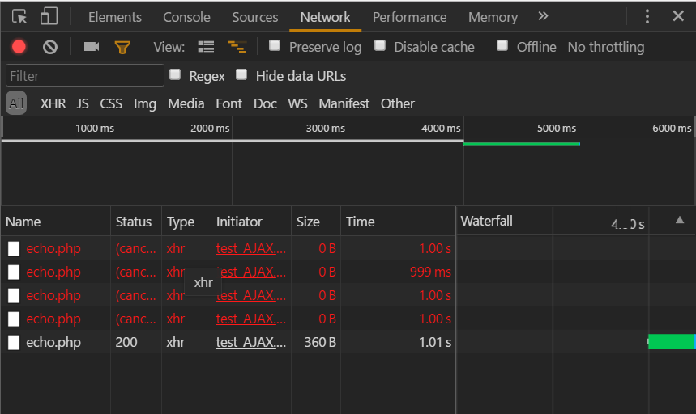
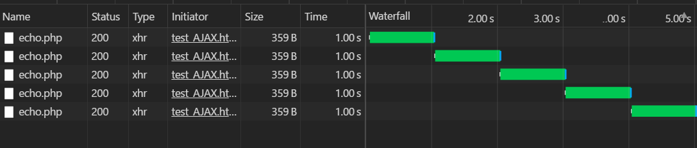
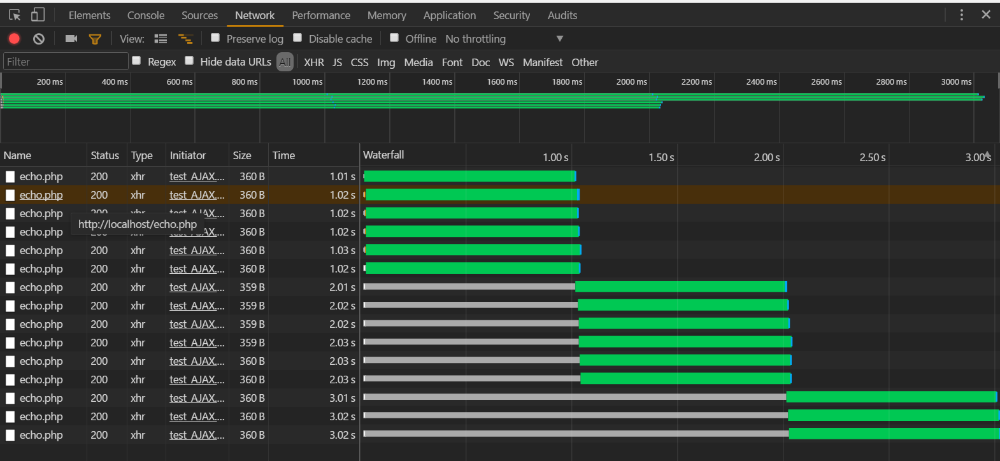
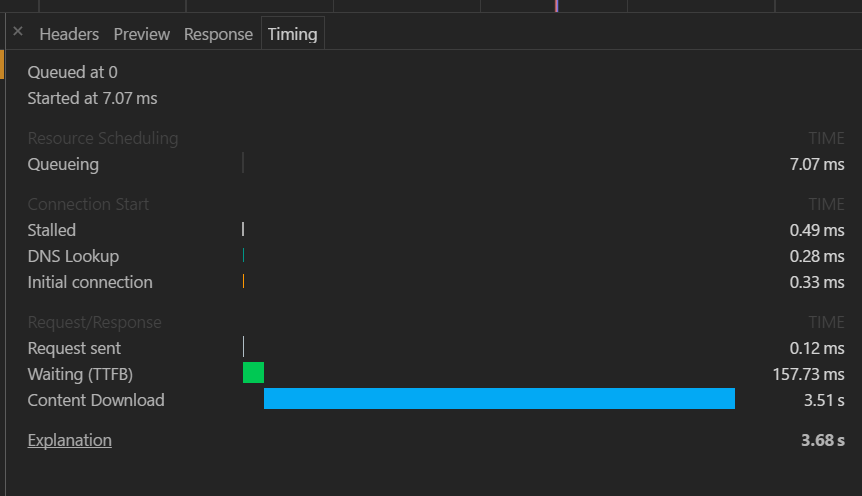

# 目的
测试全局一个XMLHttpRequest对象，用来发送ajax请求，会出现的问题。
加深对ajax的认识，以及chrome一个请求的timing分析。
分析过程如下
# 服务器端php+apache
作用是客户端发送post请求数据（json格式），根据发送的来请求进行休眠（便于观察），然后直接返回请求内容。
```php
header("Access-control-allow-origin:*");//这里我是测试的允许跨域
$str = file_get_contents('php://input'); //这里得到字符串
$data = json_decode($str);//转成JSON对象
sleep($data->sleepTime);//休眠，便于观察
//echo $data->masterIP;//如果要操作数据可以这样操作
echo json_encode($data); //json_encode又转成字符串
```
<!--more-->
# 客户端
## 使用一个XMLHttpRequest对象发送ajax请求
如下创建一个全局的`xmlHttp`对象:
```js
var xmlHttp = GetXmlHttpObject();
function GetXmlHttpObject() //check browser support
{
  var xmlHttp = null;
  try {
    // Firefox, Opera 8.0+, Safari
    xmlHttp = new XMLHttpRequest();
  } catch (e) {
    // Internet Explorer
    try {
      xmlHttp = new ActiveXObject("Msxml2.XMLHTTP");
    } catch (e) {
      xmlHttp = new ActiveXObject("Microsoft.XMLHTTP");
    }
  }
  return xmlHttp;
}
```
发送请求方法：
```js
function send1(n, sleepTime) {
  var url = "http://localhost/echo.php";
  xmlHttp.onreadystatechange = function () {
    if (xmlHttp.readyState == 4 && xmlHttp.status == 200) {
      var data = JSON.parse(xmlHttp.responseText);//解析为json对象
      console.log(data);
    }
  };
  xmlHttp.open("POST", url, true);
  var data = {
    n: n,
    sleepTime: sleepTime,
    masterIP: "172.20.1.1",
    slavesIP: ["172.20.1.2", "172.20.1.3"]
  };
  var sendData = JSON.stringify(data);
  xmlHttp.send(sendData);//发送
}
```
发送多次请求：
```js
/**
* n: 发送请求次数
* sleepTime: 控制服务器sleep时间
* tick: 控制每隔多久发送一次请求 
*/
function exec1(n, sleepTime, tick) {
  for (var i = 0; i < n; i++) {
    setTimeout((function (i) {
      return function () { send1(i, sleepTime); }
    })(i), tick * i * 1000);
  }
}
```
每隔一秒发送一次请求，服务器端休眠一秒。
```js
exec1(5,1,1);
```
结果：  

可以发现前四次请求都被取消了，只有最后一次成功。并且最后一次请求用时1.01s。 
当然如果连续发送前四次也会被取消。 

每隔1.01秒发送一次请求，服务器端休眠一秒。
```js
exec1(5,1,1.01);
```
结果：   

显然请求都成功了。
### 小结
同一个XMLHttpRequest对象，可以多次发送ajax请求，但是不能同时处理多个请求。
可以有用处：通过ajax方式进行页面无刷新更新的时候。通过ajax返回的数据插入页面这种方式更新页面内容，导航切换过快上一个请求还没返回，就会被取消，不会发生过一段时间页面出现上一次请求的内容。（我就遇到过着样的问题）。

## 通过创建多个对象同时发送ajax请求
代码如下
```js
 function send2(n, sleepTime) {
  var xmlHttp = GetXmlHttpObject();
  var sparkServerIP = "172.20.1.1";
  var url = "http://localhost/echo.php";
  xmlHttp.onreadystatechange = function () {
    if (xmlHttp.readyState == 4 && xmlHttp.status == 200) {
      var data = JSON.parse(xmlHttp.responseText);//解析为json对象
      console.log(data);
    }
  };
  xmlHttp.open("POST", url, true);
  var data = {
    n: n,
    sleepTime: sleepTime,
    masterIP: "172.20.1.1",
    slavesIP: ["172.20.1.2", "172.20.1.3"]
  };
  var sendData = JSON.stringify(data);
  xmlHttp.send(sendData);
}
 function exec2(n, sleepTime) {
  for (var i = 0; i < n; i++) {
    send2(i, sleepTime)
  }
}
exec2(15,1)
```

网络请求图：     
   
绿条部分可以看出这15次请求是分拨进行的，6个一波。说明chrome xhr请求并发量为6。 灰色线条表示：chrome等待发出请求。
   
时间线中stalled停滞不前，表示chrome请求发出前的等待时间。
多次发送同一个请求，前6次会进行dns查询和初始化连接，然后的请求会重复利用已经初始化的网络请求对象。
在request、response阶段：
包括:请求时间，waiting（ttfb）时间，和content download时间。
waiting：服务端处理时间,即受到请求到输出响应头这段时间。
content download：服务器处理完进行响应，客户端下载时间。
# 总结
 1. 同一个客户端通过ajax向apache服务器中同一个php文件发出请求，apache会创建不同的进程进行响应。
 2. 同一个xmlHttprequest实例，连续发出请求时，如果前一个请求没有返回响应，则前一个ajax请求会被取消。如果前一个请求返回，后一个请求不会取消前一个请求。
 3. 如果要同时发送多个请求要创建多个xhr对象。
 4. chrome浏览器能并发进行6个http请求。


